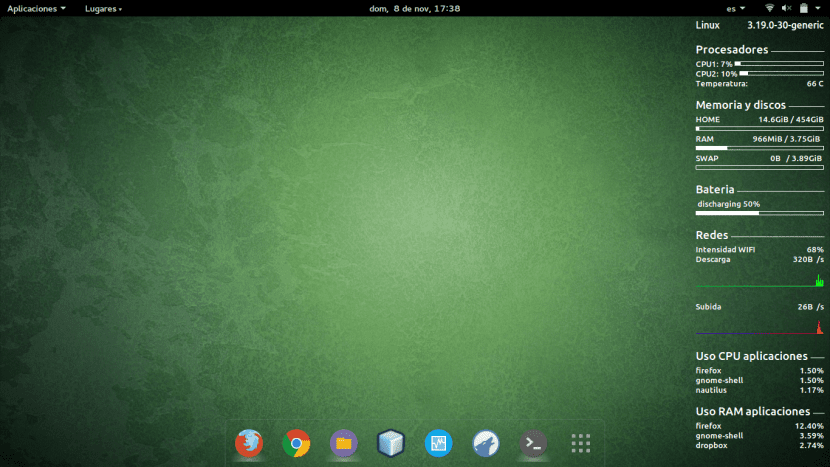

# 🖥️ Mi Configuración de Conky

Esta es mi configuración personal de Conky, diseñada para ofrecer una visión clara y minimalista 
de los recursos del sistema, inspirada en el estilo que se muestra en la imagen de referencia. 
Conky es un sistema de monitorización altamente personalizable, y en mi caso, he buscado un 
equilibrio entre funcionalidad y estética, mostrando únicamente la información más relevante.

El widget incluye secciones para el uso de CPU y GPU, temperaturas, estado de la memoria RAM y 
swap, uso de discos, nivel de batería, estadísticas de red (WiFi y descarga), e incluso un apartado 
personalizado ("Sabila"). Además, detalla el consumo de recursos por aplicación, lo que resulta muy 
útil para identificar procesos demandantes.

## 🛠️ Instalación y Uso:

Para utilizar esta configuración, simplemente guarda el archivo `conky.conf` en la carpeta `~/.config/conky/`. 
Si el directorio no existe, puedes crearlo manualmente. Una vez ubicado el archivo, reinicia Conky o inícialo 
desde terminal con el comando:

### Ejecutar:
conky -c ~/.config/conky/conky.conf

¡Espero que te sea de utilidad! Si tienes sugerencias o mejoras, no dudes en hacer un fork o abrir un issue.

