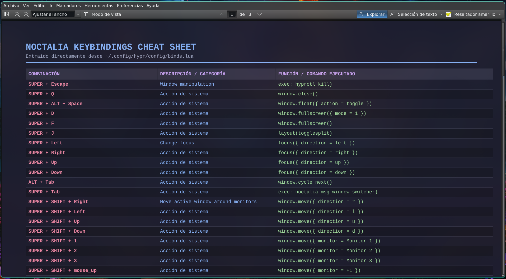

# ⌨️ keybindings.py

Un script automatizado en Python diseñado para entornos de **Hyprland** configurados con archivos **Lua**. En este caso en particularExtrae y traduce directamente tus atajos de teclado dinámicos a un documento PDF apaisado de diseño limpio, abriéndolo automáticamente en tu visor predeterminado (**Okular**).

El script está pensado para ser ejecutado desde un atajo del sistema por lo que las notificaciones de resultados y errores no se muestran bajo ese contexto. se recomienda descomentar línea 156 para ejecutar una prueba.

No está compilado porque me gusta mantener al alcance la posibilidad de mejorarlo.

---

## 🌟 Características Principales

* **Generación en tiempo real:** Olvídate de mantener hojas de atajos estáticas o desactualizadas. Cada vez que lanzas el script, lee la configuración activa de tus bindings y refleja **cualquier modificación reciente al instante** en un nuevo PDF.
* **Soporte nativo para sintaxis Lua:** Diseñado específicamente para estructuras avanzadas basadas en `hl.bind()`, expandiendo dinámicamente variables de entorno (`mainMod`, `noctCall`, `launchPrefix`, variables de terminal/navegador, etc.).
* **Extracción inteligente de contexto:** Asocia automáticamente los comentarios y secciones de tu archivo `.lua` como descripciones para cada combinación.
* **Formato Apaisado (Landscape):** Maquetado en HTML/CSS y renderizado con `WeasyPrint` para optimizar el espacio horizontal y leer con claridad comandos extensos (como llamadas a `uwsm` o `noctalia`).
* **Apertura automática:** Compila el archivo en `/tmp` y el directorio del usuario, lanzando inmediatamente **Okular** para una consulta fluida.

---

## ⚙️ ¿Cómo Funciona?

A diferencia de las herramientas tradicionales que dependen de `hyprctl binds -j` (las cuales devuelven punteros genéricos `__lua` cuando se ejecutan funciones dinámicas), este script realiza un **parsing estático inteligente**:

1. **Lectura directa:** Analiza línea por línea el archivo `~/.config/hypr/config/binds.lua`.
2. **Sustitución de variables:** Reemplaza las constantes de modmask y comandos intermedios por sus valores reales.
3. **Renderizado PDF:** Genera una maqueta estructurada por columnas (Combinación, Descripción/Categoría y Comando Ejecutado).

---

## 🚀 Requisitos e Instalación

### Dependencias

Asegúrate de tener instaladas las siguientes herramientas en tu sistema (ejemplo para Arch/CachyOS):

```bash
sudo pacman -S python weasyprint okular
```

Nota: Recuerda darle permisos de ejecución:
```bash
chmod +x ~/.local/bin/keybindings.py
```


